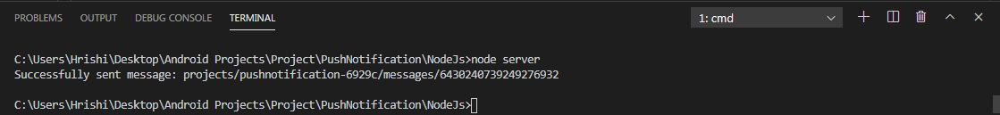
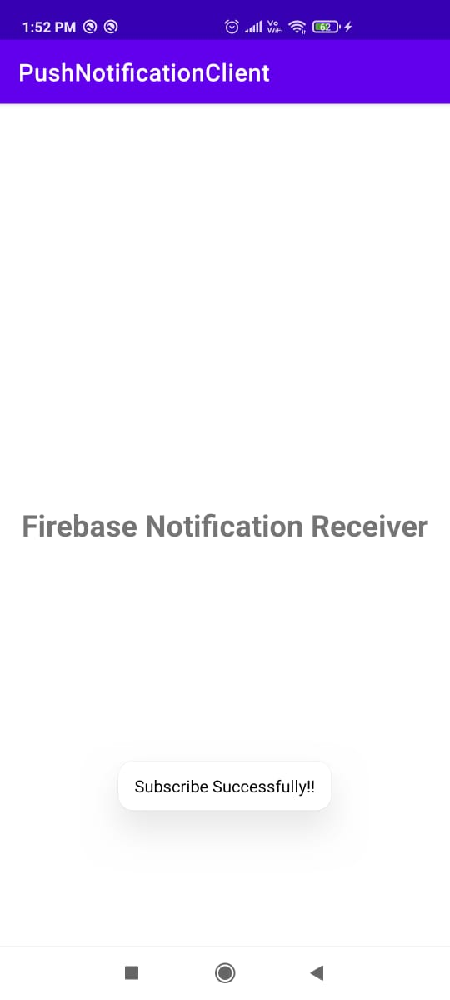
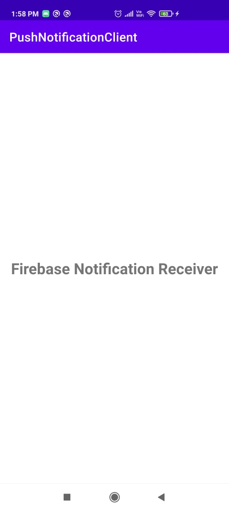
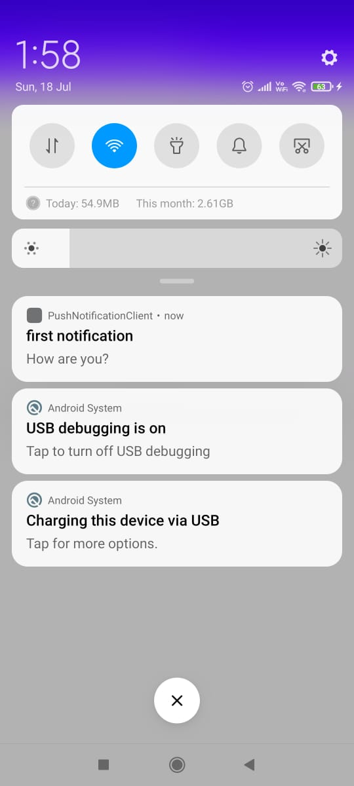

# PushNotification-Nodejs-Android 
This is push notification from node js to android. 
I) Create on folder for node js and server.js file. 
II) Open same folder on cmd and run following commands.(make sure that node is already install in your system.). 
  a)npm init -y 
  b)npm install firebase-admin 
III) Download json file from firebase project. 
  a) create one firebase project and go to project settings -> service accounts -> click on Generate new private key and add downloaded json file in node js folder. 
  b) add that file path in server.js file. 
IV) Run the following command to make sure that notification is send from node js to firebase. You will get following output: 
 
V) Create android project, give name to project (here PushNotificationClient) and connect that project to firebase. 
VI) To connect firebase, Open android studio -> Tools -> firebase -> search Cloud messaging -> click on connect to firebase and select your project in browser. 
VII) next step is to add cloud messaging dependancy to your project. 

